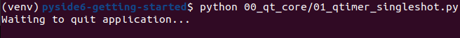

# PySide6 Qt Core examples

[Home](https://github.com/Erriez/pyside6-getting-started#PySide6-Examples)

## [01_qtimer_singleshot.py](01_qtimer_singleshot.png)

## [02_pyside_version.py](02_pyside_version.png)

