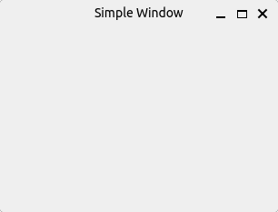
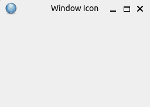
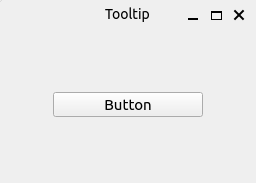
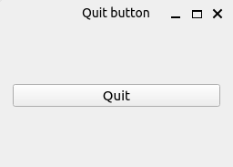
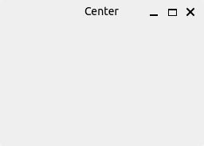
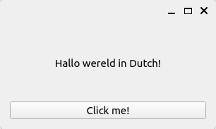
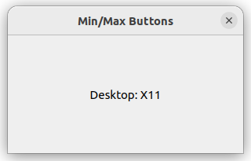

# PySide6 Getting Started

[Home](https://github.com/Erriez/pyside6-getting-started#PySide6-Examples)

## [01_simple_example.py](01_simple_example.py)

## [02_window_icon.py](02_window_icon.py)

## [03_tooltip.py](03_tooltip.py)

## [04_closing_a_window.py](04_closing_a_window.py)

## [05_window_center.py](05_window_center.py)

## [06_window_button.py](06_window_button.py)

## [07_window_hide_min_max.py](07_window_hide_min_max.py)

