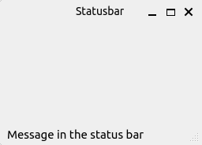
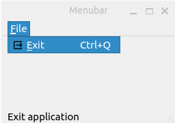
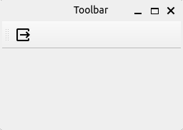
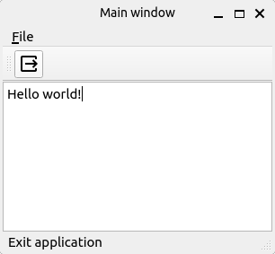

# PySide6 Menu's and Toolbars

[Home](https://github.com/Erriez/pyside6-getting-started#PySide6-Examples)

## [01_statusbar.py](01_statusbar.py)

## [02_menubar.py](02_menubar.py)

## [03_toolbar.py](03_toolbar.py)

## [04_menubar_toolbar_statusbar.py](04_menubar_toolbar_statusbar.py)

