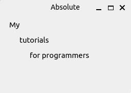
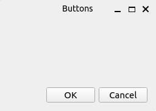
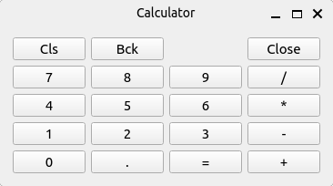
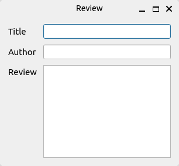

# PySide6 Layout Management

[Home](https://github.com/Erriez/pyside6-getting-started#PySide6-Examples)

## [01_absolute_positioning.py](01_absolute_positioning.py)

## [02_box_layout.py](02_box_layout.py)

## [03_grid_layout.py](03_grid_layout.py)

## [04_grid_layout_span.py](04_grid_layout_span.py)

