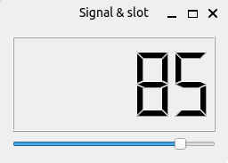

# PySide6 Layout Management

[Home](https://github.com/Erriez/pyside6-getting-started#PySide6-Examples)

## [01_signals_and_slots.py](01_signals_and_slots.py)

## [02_event_handler_key_press.py](02_event_handler_key_press.py)

## [03_event_sender.py](03_event_sender.py)

## [04_emitting_signals.py](04_emitting_signals.py)

