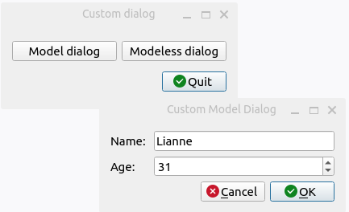

# PySide6 Dialogs

[Home](https://github.com/Erriez/pyside6-getting-started#PySide6-Examples)

## [01_input_dialog.py](01_input_dialog.py)

## [02_color_dialog.py](02_color_dialog.py)

## [03_font_dialog.py](03_font_dialog.py)

## [04_file_dialog.py](04_file_dialog.py)

## [05_custom_dialog.py](05_custom_dialog.py)

## [06_dialog_model_modeless.py](06_dialog_model_modeless.py)

