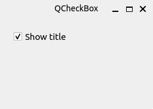
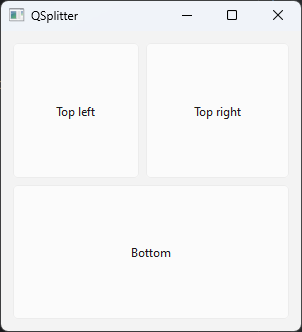

# PySide6 Widgets

[Home](https://github.com/Erriez/pyside6-getting-started#PySide6-Examples)

## [01_checkbox.py](01_checkbox.py)

## [02_toggle_buttons.py](02_toggle_buttons.py)

## [03_slider.py](03_slider.py)

## [04_progressbar.py](04_progressbar.py)

## [05_calendar.py](05_calendar.py)

## [06_qpixmap.py](06_qpixmap.py)

## [07_lineedit.py](07_lineedit.py)

## [08_splitter.py](08_splitter.py)

## [09_combobox.py](09_combobox.py)

## [10_standard_icons.py](10_standard_icons.py)

