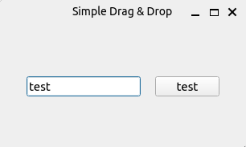
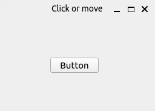

# PySide6 Widgets Specifics

[Home](https://github.com/Erriez/pyside6-getting-started#PySide6-Examples)

## [01_simple_drag_and_drop.py](01_simple_drag_and_drop.py)

## [02_drag_and_drop_button.py](02_drag_and_drop_button.py)

