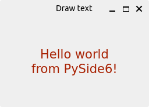
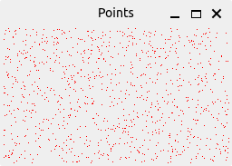
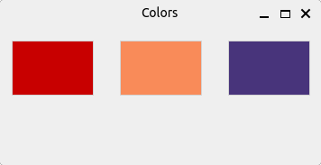
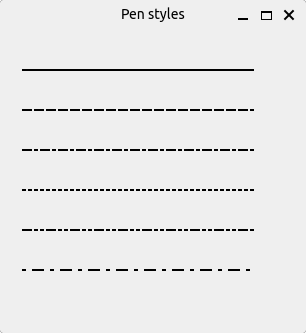
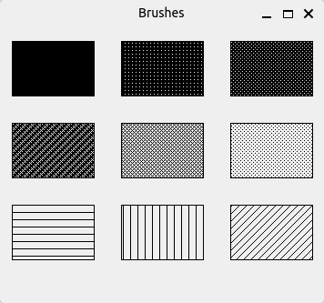

# PySide6 Drawing

[Home](https://github.com/Erriez/pyside6-getting-started#PySide6-Examples)

## [01_drawing_text.py](01_drawing_text.py)

## [02_drawing_points.py](02_drawing_points.py)

## [03_colors.py](03_colors.py)

## [04_pen.py](04_pen.py)

## [05_brush.py](05_brush.py)

