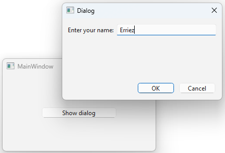

# PySide6 Qt Creator

[Home](https://github.com/Erriez/pyside6-getting-started#PySide6-Examples)

## [qt_creator_qwidget.py](01_qt_creator_qwidget/qt_creator_qwidget.py)

## [qt_creator_main.py](02_qt_creator_dialog/qt_creator_main.py)

