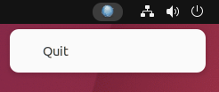
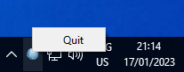
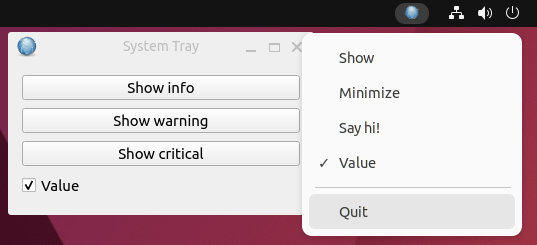
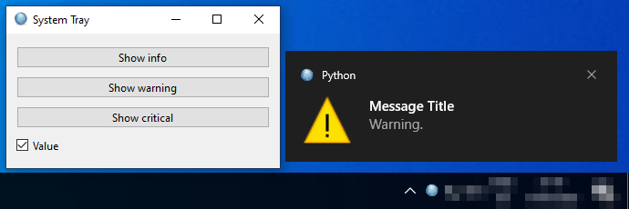

# PySide6 System Tray Icon

[Home](https://github.com/Erriez/pyside6-getting-started#PySide6-Examples)

## [01_system_tray.py](01_system_tray.py)

## [02_system_tray_advanced.py](02_system_tray_advanced.py)

