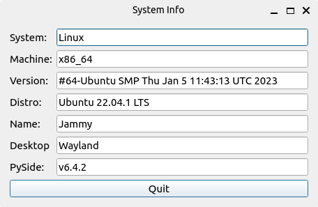
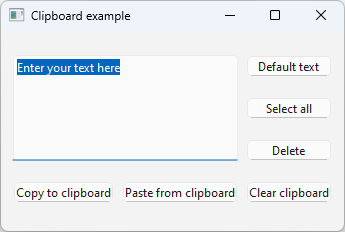
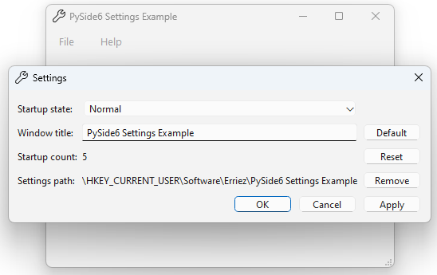

# PySide6 Desktop Applications

[Home](https://github.com/Erriez/pyside6-getting-started#PySide6-Examples)

## [01_system_info.py](01_system_info.py)

## [02_clipboard.py](02_clipboard.py)

## [03_settings.py](03_settings.py)

