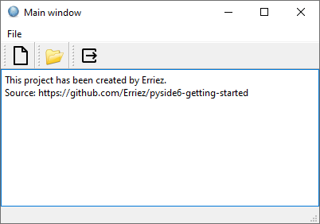

# PySide6 Deployment

[Home](https://github.com/Erriez/pyside6-getting-started#PySide6-Examples)

## [01_deployment.py](01_deployment.py)




### Linux: Create .deb installer

```
# Build executable and installer
$ ./build_linux.sh

# Run setup
$ ./pyside6_deployment_example.deb

# Uninstall
$ $HOME/.local/bin/erriez/pyside6_deployment_example/uninstall.sh
```

### Windows: Create .exe installer

Download and install [NSIS](https://nsis.sourceforge.io/Download).

```
# Build executable and installer
> build_windows.bat

# Run setup
> 01_deployment_setup.exe

# Uninstall: Via Windows Start Menu or Settings | Apps 
```
