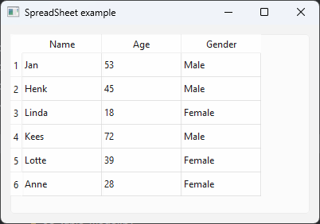
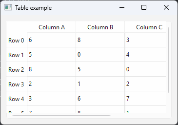

# PySide6 Tables

[Home](https://github.com/Erriez/pyside6-getting-started#PySide6-Examples)

## [01_table_spreadsheet.py](01_table_spreadsheet.py)

## [02_table_spreadsheet_custom.py](02_table_spreadsheet_custom.py)

## [03_table_model.py](03_table_model.py)

