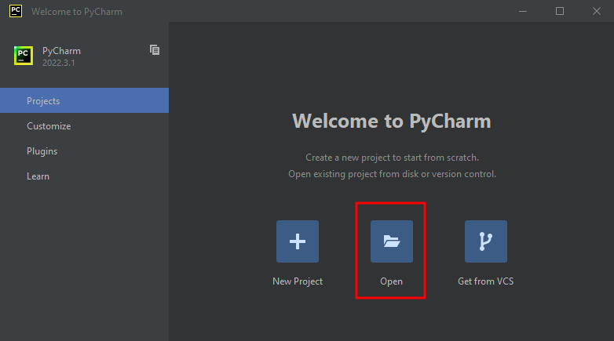
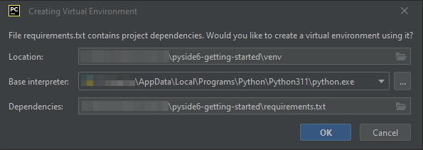
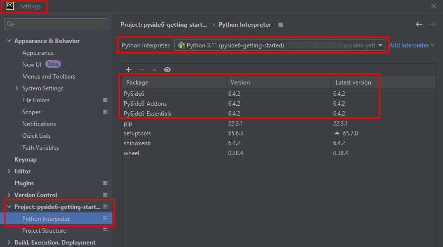
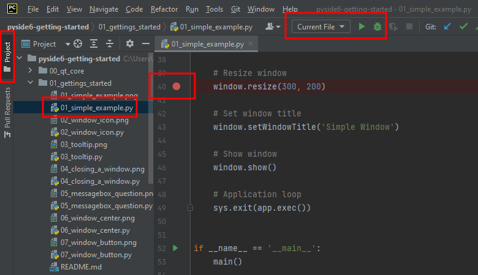
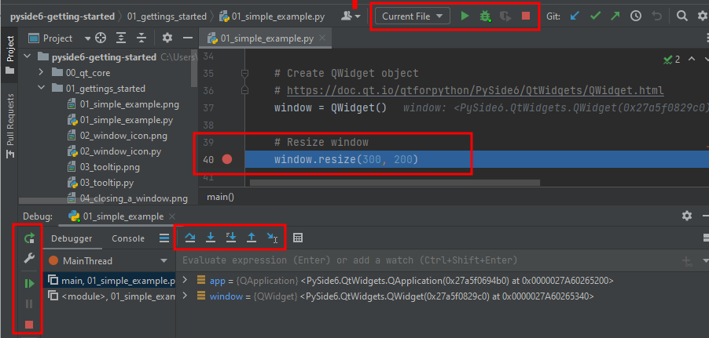

# Developing PySide6 with Jetbrains PyCharm

- Download and install [PyCharm Community](https://www.jetbrains.com/pycharm/download/#section=linux)
- 
- Start PyCharm and open `pyside6-getting-started`:

- Click Ok to setup virtual environment:

- To configure the Python environment manually, go to `File | Settings | Project | Python Interpreter`:

- Wait until progress bar on the bottom is completed.

- Open a Python file from the `Project` tab and set a breakpoint and click the debug icon:

- Use the `F9`..`F11` keys to step through the code:

